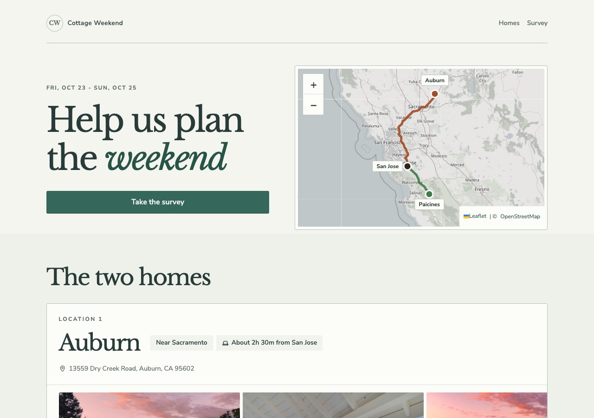
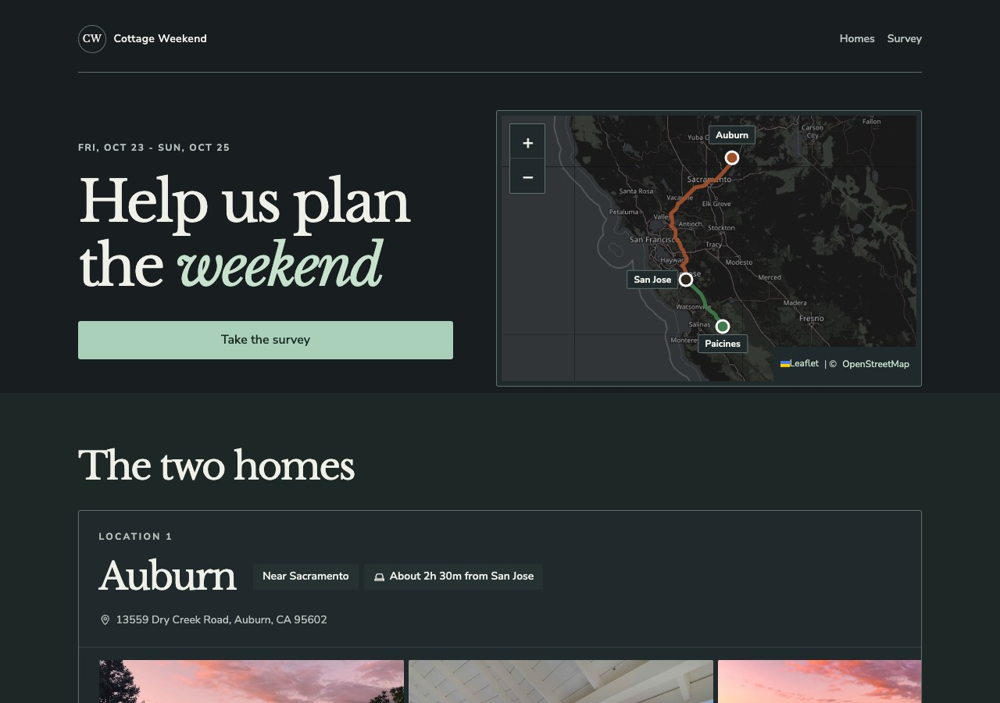

# Mobile pass report

Chrome DevTools emulation was run with touch enabled for phone widths and at 1280 px for desktop sanity.

## Before

| 390 px light | 390 px dark |
| --- | --- |
|  |  |

## After phone

| 390 px light | 390 px dark |
| --- | --- |
|  |  |

## After desktop

| 1280 px light | 1280 px dark |
| --- | --- |
|  |  |

## Page weight

Measured as local first-party payload selected for a 390 px mobile viewport at DPR 2. Third-party fonts, map tiles, and Google Maps embeds are excluded because their cache state and cross-origin timing data vary by browser session.

| Payload | Before | After |
| --- | ---: | ---: |
| Initial visible photo strip images plus first-party HTML/CSS/JS | 399 KiB | 328 KiB |
| Full photo-strip image set plus first-party HTML/CSS/JS | 1442 KiB | 879 KiB |

At DPR 1 the responsive 480 px photo candidates bring the full photo-strip image payload to about 474 KiB.

## Verification

- Chrome DevTools emulation at 320, 360, 375, 390, and 430 px, touch enabled, light and dark: no horizontal overflow and no visible touch target under 44 px.
- Chrome DevTools emulation at 1280 px, light and dark: no horizontal overflow and no visible touch target under 44 px.
- Photo strips keep six photos per home after replacing the Auburn bedroom with the satsang space and replacing the Paicines den with the property and pool view.
- Question numbers render as 1, 2, 3 rather than 01, 02, 03.
- The mixed rhythm option was removed. `apps-script/Code.gs` only validates that `rhythm` is a present string with allowed length, so the remaining answer values need no Apps Script change.
- Section background bands were checked in the Paper Lantern style direction: each major section has its own subtle band while keeping the approved layout.
- Landscape sanity checked with the mobile landscape media rule reducing the hero map height.
- Lighthouse mobile: Accessibility 100, SEO 100, Best Practices 96. The remaining Best Practices item was low-resolution third-party OpenStreetMap tiles on high-DPR emulation.
- Emulation cannot prove real iOS Safari behavior around the dynamic address bar, momentum scrolling, safe-area insets, or Leaflet touch event edge cases. A real iPhone pass is still recommended before relying on those platform details.
