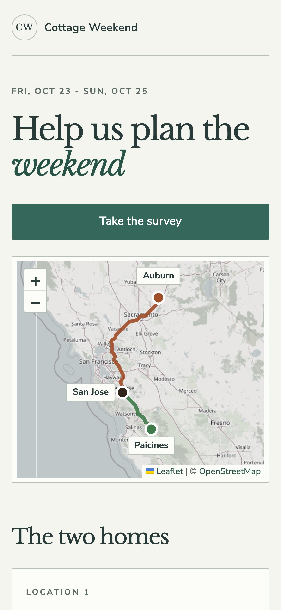
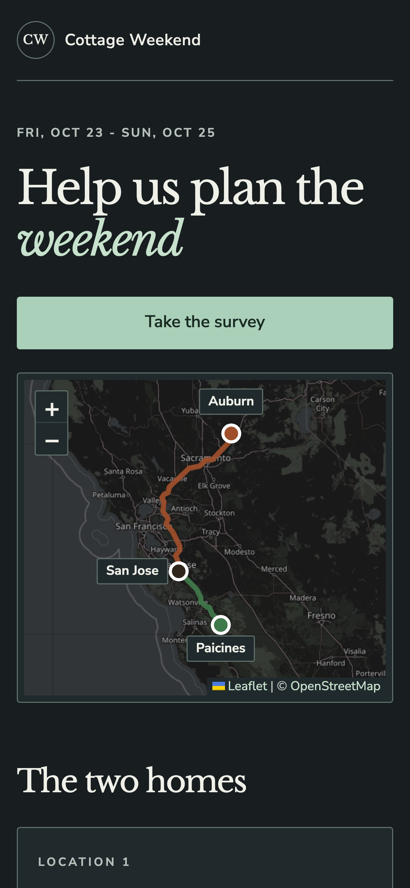
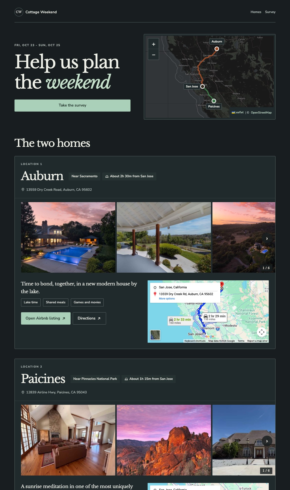
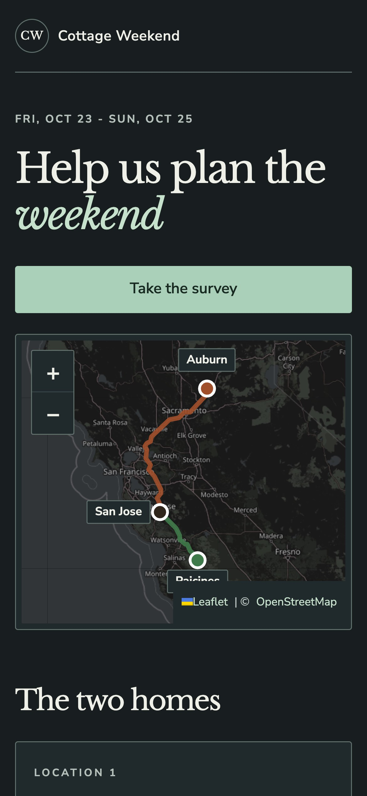

# Mobile pass report

Chrome DevTools emulation was run with touch enabled. Screenshots below use a 390 px wide mobile viewport.

## Before

| Light | Dark |
| --- | --- |
|  |  |

## After

| Light | Dark |
| --- | --- |
|  |  |

## Page weight

Measured as local first-party payload selected for a 390 px mobile viewport at DPR 2. Third-party fonts, map tiles, and Google Maps embeds are excluded because their cache state and cross-origin timing data vary by browser session.

| Payload | Before | After |
| --- | ---: | ---: |
| Initial visible photo strip images plus first-party HTML/CSS/JS | 399 KiB | 327 KiB |
| Full photo-strip image set plus first-party HTML/CSS/JS | 1442 KiB | 836 KiB |

At DPR 1 the responsive 480 px photo candidates bring the full photo-strip image payload to about 399 KiB.

## Verification

- Chrome DevTools emulation at 320, 360, 375, 390, and 430 px, touch enabled, light and dark: no horizontal overflow.
- Visible links and controls checked for 44 px minimum touch target sizing. The only reported exception was the offscreen honeypot input.
- Landscape sanity checked with the mobile landscape media rule reducing the hero map height.
- Lighthouse mobile: Accessibility 100, SEO 100, Best Practices 96. The remaining Best Practices item is low-resolution third-party OpenStreetMap tiles on high-DPR emulation.
- Emulation cannot prove real iOS Safari behavior around the dynamic address bar, momentum scrolling, safe-area insets, or Leaflet touch event edge cases. A real iPhone pass is still recommended before relying on those platform details.
